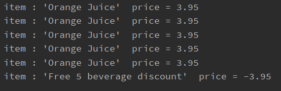

# CoffeeShop
 Abstract Factory Implementation Challenge

It's developed to follow a Service Design approach, based using techniques like TDD and best practices like SOLID principles.

* How Run this App:
  - 
  You will need run ReceiptCreator class.
  
* Documentation:
  - 

You have a principal Menu with the products, also for a special products you have options for extra products 

if you press exit key then you can see the receipt with the final price.
* Especial cases:
  
    Exist customer stamp card, where every 5th beverage is for free. For example:
  

  If a customer orders a beverage and a snack, one of the extra's is free.. For example:
  
  
Technologies:
  -
+ BackEnd: 
  It's an application developed with Java 8, Junit 4, TDD approach.

Technical Design(Service Oriented):
-
The application has a logical folder separation in order to read clearly some "layers".
  * Application Folder: contains the different services to have interaction with Domain objects creations (Factories implementations).
  * Domain Folder: contains Domain objects and their own logic.

  
    
             
